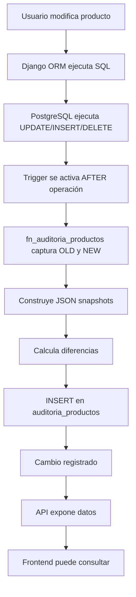

# 🔍 Sistema de Auditoría de Productos - Inventrix

<div align="center">


**Sistema automático de trazabilidad y auditoría de cambios en productos**

[🎯 Características](#-características) • [🛠️ Implementación](#️-implementación) • [📊 Uso](#-uso) • [💡 Casos de Uso](#-casos-de-uso)

</div>

---

## 📋 Tabla de Contenidos

- [¿Qué es?](#-qué-es)
- [Características](#-características)
- [Arquitectura](#-arquitectura)
- [Implementación](#️-implementación)
- [Cómo Funciona](#-cómo-funciona)
- [Uso del Sistema](#-uso-del-sistema)
- [API Endpoints](#-api-endpoints)
- [Casos de Uso](#-casos-de-uso)
- [Consultas Útiles](#-consultas-útiles)

---

## 🎯 ¿Qué es?

El **Sistema de Auditoría de Productos** es una solución automática que registra **todos los cambios** realizados en la tabla de productos, proporcionando trazabilidad completa y transparencia en las operaciones del inventario.

### 🔑 Características Clave

- ✅ **Automático**: Se ejecuta sin intervención manual mediante triggers de PostgreSQL
- ✅ **Completo**: Registra INSERT, UPDATE y DELETE
- ✅ **Detallado**: Guarda datos anteriores y nuevos en cada cambio
- ✅ **Trazable**: Incluye usuario, fecha, hora y cambios calculados
- ✅ **Eficiente**: Usa índices optimizados para consultas rápidas
- ✅ **Integrado**: Expuesto vía API REST para el frontend

---

## ✨ Características

### 📊 Registro Automático

| Operación | Qué Registra | Cuándo |
|-----------|--------------|--------|
| **INSERT** | Datos del nuevo producto | Al crear un producto |
| **UPDATE** | Datos anteriores y nuevos | Al modificar un producto |
| **DELETE** | Datos del producto eliminado | Al eliminar un producto |

### 📈 Información Capturada

<table>
<tr>
<td width="50%">

**Datos Básicos**
- ID del producto
- SKU
- Nombre
- Tipo de operación

</td>
<td width="50%">

**Cambios Específicos**
- Cantidad anterior/nueva
- Precio compra anterior/nuevo
- Precio final anterior/nuevo
- Diferencias calculadas

</td>
</tr>
<tr>
<td width="50%">

**Metadata**
- Fecha y hora del cambio
- Usuario que realizó el cambio
- IP address (opcional)

</td>
<td width="50%">

**Snapshots Completos**
- JSON con todos los datos anteriores
- JSON con todos los datos nuevos
- Trazabilidad total

</td>
</tr>
</table>

---

## 🏗️ Arquitectura

### Componentes del Sistema

```
┌─────────────────────────────────────────────────────────┐
│                    FRONTEND (React)                      │
│  ┌────────────────────────────────────────────────┐    │
│  │  Componente de Auditoría (futuro)              │    │
│  │  - Ver historial de cambios                    │    │
│  │  - Filtrar por producto/fecha/usuario          │    │
│  └────────────────────────────────────────────────┘    │
└──────────────────────┬──────────────────────────────────┘
                       │ HTTP/REST API
                       │
┌──────────────────────┴──────────────────────────────────┐
│                    BACKEND (Django)                      │
│  ┌────────────────────────────────────────────────┐    │
│  │  AuditoriaProductoViewSet                       │    │
│  │  - GET /api/auditoria-productos/               │    │
│  │  - GET /api/auditoria-productos/{id}/          │    │
│  │  - GET /api/auditoria-productos/estadisticas/  │    │
│  │  - GET /api/auditoria-productos/por_producto/  │    │
│  └────────────────────────────────────────────────┘    │
│  ┌────────────────────────────────────────────────┐    │
│  │  AuditoriaProducto Model (Django ORM)          │    │
│  │  - Mapea tabla auditoria_productos             │    │
│  │  - Serializers para JSON                       │    │
│  └────────────────────────────────────────────────┘    │
└──────────────────────┬──────────────────────────────────┘
                       │ SQL Queries
                       │
┌──────────────────────┴──────────────────────────────────┐
│              BASE DE DATOS (PostgreSQL)                  │
│  ┌────────────────────────────────────────────────┐    │
│  │  Tabla: productos                               │    │
│  │  ┌──────────────────────────────────────┐      │    │
│  │  │  TRIGGER: trg_auditoria_productos    │      │    │
│  │  │  AFTER INSERT OR UPDATE OR DELETE    │      │    │
│  │  └──────────────┬───────────────────────┘      │    │
│  └─────────────────┼────────────────────────────────┘    │
│                    │                                     │
│  ┌─────────────────▼────────────────────────────────┐    │
│  │  Función: fn_auditoria_productos()              │    │
│  │  - Captura OLD y NEW                            │    │
│  │  - Construye JSON snapshots                     │    │
│  │  - Calcula diferencias                          │    │
│  │  - Inserta en auditoria_productos               │    │
│  └─────────────────┬────────────────────────────────┘    │
│                    │                                     │
│  ┌─────────────────▼────────────────────────────────┐    │
│  │  Tabla: auditoria_productos                     │    │
│  │  - Almacena todos los cambios                   │    │
│  │  - Índices optimizados                          │    │
│  │  - Vistas para consultas rápidas                │    │
│  └─────────────────────────────────────────────────┘    │
└─────────────────────────────────────────────────────────┘
```

---

## 🛠️ Implementación

### Tecnologías Utilizadas

| Componente | Tecnología | Propósito |
|------------|------------|-----------|
| **Base de Datos** | PostgreSQL 16 | Almacenamiento y triggers |
| **Trigger** | PL/pgSQL | Captura automática de cambios |
| **Backend** | Django 6.0 + DRF | API REST y modelos |
| **ORM** | Django ORM | Mapeo objeto-relacional |
| **Serialización** | Django REST Framework | Conversión a JSON |

### Archivos Creados

```
backend/
├── create_auditoria_productos.sql      # SQL completo del sistema
├── setup_auditoria_productos.py        # Script de instalación
├── inventory/
│   └── models.py                        # Modelo AuditoriaProducto
├── api/
│   ├── serializers.py                   # AuditoriaProductoSerializer
│   ├── views.py                         # AuditoriaProductoViewSet
│   └── urls.py                          # Rutas de la API
```

### Instalación

#### Paso 1: Ejecutar el Script SQL

```bash
cd backend
python setup_auditoria_productos.py
```

**Salida esperada:**
```
============================================================
🔧 CONFIGURACIÓN DE AUDITORÍA DE PRODUCTOS
============================================================
📄 Leyendo archivo: create_auditoria_productos.sql
⚙️  Ejecutando SQL...
✅ SQL ejecutado exitosamente

🔍 Verificando instalación...

📊 Estado de la instalación:
   ✓ Tabla 'auditoria_productos': ✅ Existe
   ✓ Trigger 'trg_auditoria_productos': ✅ Existe
   ✓ Registros de auditoría: 0

✅ Sistema de auditoría configurado correctamente
```

#### Paso 2: Verificar en Django

```bash
python manage.py shell
```

```python
from inventory.models import AuditoriaProducto

# Ver si hay registros
print(AuditoriaProducto.objects.count())

# Ver últimos cambios
for auditoria in AuditoriaProducto.objects.all()[:5]:
    print(f"{auditoria.operacion} - {auditoria.nombre_producto}")
```

---

## ⚙️ Cómo Funciona

### Flujo de Auditoría



### Ejemplo Práctico

**Escenario:** Actualizar el precio de un producto

```python
# 1. Usuario actualiza producto desde Django
producto = Producto.objects.get(id=1)
producto.precio_final = 150.00  # Era 100.00
producto.save()

# 2. Trigger se ejecuta automáticamente
# 3. Se crea registro en auditoria_productos:
{
    "id_auditoria": 42,
    "id_producto": 1,
    "sku_producto": "PROD-001",
    "nombre_producto": "Aceite Motor 10W40",
    "operacion": "UPDATE",
    "precio_final_anterior": 100.00,
    "precio_final_nuevo": 150.00,
    "diferencia_precio_final": 50.00,
    "fecha_cambio": "2026-04-27 14:30:00",
    "usuario": "postgres",
    "datos_anteriores": {...},  # JSON completo
    "datos_nuevos": {...}        # JSON completo
}
```

---

## 📊 Uso del Sistema

### Desde Python/Django

```python
from inventory.models import AuditoriaProducto

# Ver últimos 10 cambios
ultimos_cambios = AuditoriaProducto.objects.all()[:10]

# Ver cambios de un producto específico
historial = AuditoriaProducto.objects.filter(id_producto=1)

# Ver solo actualizaciones
actualizaciones = AuditoriaProducto.objects.filter(operacion='UPDATE')

# Ver cambios de hoy
from datetime import date
hoy = AuditoriaProducto.objects.filter(fecha_cambio__date=date.today())

# Ver cambios por usuario
cambios_usuario = AuditoriaProducto.objects.filter(usuario='admin')
```

### Desde SQL Directo

```sql
-- Ver últimos 20 cambios
SELECT * FROM v_auditoria_reciente LIMIT 20;

-- Ver historial de un producto
SELECT * FROM fn_historial_producto(1);

-- Ver productos con más cambios
SELECT * FROM v_auditoria_por_producto LIMIT 10;

-- Ver cambios de stock
SELECT * FROM v_auditoria_stock LIMIT 20;

-- Ver cambios de precios
SELECT * FROM v_auditoria_precios LIMIT 20;

-- Estadísticas generales
SELECT * FROM fn_estadisticas_auditoria();
```

---

## 🌐 API Endpoints

### Listar Auditorías

```http
GET /api/auditoria-productos/
```

**Parámetros de consulta:**
- `id_producto`: Filtrar por producto
- `operacion`: Filtrar por tipo (INSERT, UPDATE, DELETE)
- `fecha_inicio`: Fecha de inicio
- `fecha_fin`: Fecha de fin
- `search`: Buscar por SKU, nombre o usuario

**Respuesta:**
```json
{
  "count": 150,
  "next": "http://api.../auditoria-productos/?page=2",
  "previous": null,
  "results": [
    {
      "id_auditoria": 42,
      "id_producto": 1,
      "sku_producto": "PROD-001",
      "nombre_producto": "Aceite Motor 10W40",
      "operacion": "UPDATE",
      "operacion_display": "Modificación",
      "tipo_cambio": "Precio +C$50.00",
      "cantidad_anterior": 100,
      "cantidad_nueva": 100,
      "diferencia_cantidad": 0,
      "precio_final_anterior": "100.00",
      "precio_final_nuevo": "150.00",
      "diferencia_precio_final": "50.00",
      "fecha_cambio": "2026-04-27T14:30:00Z",
      "usuario": "postgres"
    }
  ]
}
```

### Obtener Auditoría Específica

```http
GET /api/auditoria-productos/{id}/
```

### Estadísticas Generales

```http
GET /api/auditoria-productos/estadisticas/
```

**Respuesta:**
```json
{
  "total_registros": 1523,
  "total_inserts": 450,
  "total_updates": 1000,
  "total_deletes": 73,
  "productos_modificados": 234,
  "fecha_primer_registro": "2024-01-15T10:00:00Z",
  "fecha_ultimo_registro": "2026-04-27T14:30:00Z"
}
```

### Historial de Producto

```http
GET /api/auditoria-productos/por_producto/?id_producto=1
```

**Respuesta:**
```json
[
  {
    "id_auditoria": 42,
    "operacion": "UPDATE",
    "cantidad_anterior": 100,
    "cantidad_nueva": 100,
    "precio_anterior": "100.00",
    "precio_nuevo": "150.00",
    "fecha_cambio": "2026-04-27T14:30:00Z",
    "usuario": "postgres"
  },
  {
    "id_auditoria": 35,
    "operacion": "UPDATE",
    "cantidad_anterior": 150,
    "cantidad_nueva": 100,
    "precio_anterior": "100.00",
    "precio_nuevo": "100.00",
    "fecha_cambio": "2026-04-20T09:15:00Z",
    "usuario": "admin"
  }
]
```

---

## 💡 Casos de Uso

### 1. 🔍 Investigar Cambio de Precio Inesperado

**Problema:** Un cliente reporta que el precio de un producto cambió sin aviso.

**Solución:**
```python
# Buscar cambios de precio del producto
cambios = AuditoriaProducto.objects.filter(
    id_producto=producto_id,
    diferencia_precio_final__isnull=False
).order_by('-fecha_cambio')

for cambio in cambios:
    print(f"Cambio el {cambio.fecha_cambio}")
    print(f"Usuario: {cambio.usuario}")
    print(f"Precio anterior: C${cambio.precio_final_anterior}")
    print(f"Precio nuevo: C${cambio.precio_final_nuevo}")
    print(f"Diferencia: C${cambio.diferencia_precio_final}")
```

**Resultado:** Identificas quién, cuándo y cuánto cambió el precio.

---

### 2. 📉 Rastrear Pérdida de Stock

**Problema:** El stock de un producto disminuyó drásticamente.

**Solución:**
```sql
SELECT 
    fecha_cambio,
    cantidad_anterior,
    cantidad_nueva,
    diferencia_cantidad,
    usuario
FROM auditoria_productos
WHERE id_producto = 123
  AND diferencia_cantidad < 0
ORDER BY fecha_cambio DESC;
```

**Resultado:** Ves todas las disminuciones de stock con fecha y responsable.

---

### 3. 📊 Reporte de Actividad Mensual

**Problema:** Necesitas un reporte de cuántos productos se modificaron este mes.

**Solución:**
```python
from datetime import datetime, timedelta

inicio_mes = datetime.now().replace(day=1)
cambios_mes = AuditoriaProducto.objects.filter(
    fecha_cambio__gte=inicio_mes
)

print(f"Total de cambios: {cambios_mes.count()}")
print(f"Productos afectados: {cambios_mes.values('id_producto').distinct().count()}")
print(f"Inserciones: {cambios_mes.filter(operacion='INSERT').count()}")
print(f"Actualizaciones: {cambios_mes.filter(operacion='UPDATE').count()}")
print(f"Eliminaciones: {cambios_mes.filter(operacion='DELETE').count()}")
```

---

### 4. 🔐 Auditoría de Seguridad

**Problema:** Necesitas saber qué usuario eliminó productos.

**Solución:**
```sql
SELECT 
    id_producto,
    sku_producto,
    nombre_producto,
    fecha_cambio,
    usuario,
    datos_anteriores
FROM auditoria_productos
WHERE operacion = 'DELETE'
ORDER BY fecha_cambio DESC;
```

**Resultado:** Lista completa de productos eliminados con responsable y datos completos.

---

### 5. 📈 Análisis de Tendencias de Precios

**Problema:** Quieres ver cómo han evolucionado los precios de un producto.

**Solución:**
```python
historial = AuditoriaProducto.objects.filter(
    id_producto=producto_id,
    operacion='UPDATE'
).order_by('fecha_cambio')

precios = []
for cambio in historial:
    if cambio.precio_final_nuevo:
        precios.append({
            'fecha': cambio.fecha_cambio,
            'precio': float(cambio.precio_final_nuevo)
        })

# Graficar con matplotlib o enviar al frontend
```

---

## 📚 Consultas Útiles

### Top 10 Productos Más Modificados

```sql
SELECT 
    id_producto,
    sku_producto,
    nombre_producto,
    COUNT(*) as total_cambios
FROM auditoria_productos
GROUP BY id_producto, sku_producto, nombre_producto
ORDER BY total_cambios DESC
LIMIT 10;
```

### Cambios en las Últimas 24 Horas

```sql
SELECT * FROM auditoria_productos
WHERE fecha_cambio >= NOW() - INTERVAL '24 hours'
ORDER BY fecha_cambio DESC;
```

### Usuarios Más Activos

```sql
SELECT 
    usuario,
    COUNT(*) as total_cambios,
    COUNT(DISTINCT id_producto) as productos_afectados
FROM auditoria_productos
GROUP BY usuario
ORDER BY total_cambios DESC;
```

### Productos con Cambios de Precio Frecuentes

```sql
SELECT 
    id_producto,
    nombre_producto,
    COUNT(*) as cambios_precio
FROM auditoria_productos
WHERE diferencia_precio_final IS NOT NULL
  AND diferencia_precio_final <> 0
GROUP BY id_producto, nombre_producto
HAVING COUNT(*) > 5
ORDER BY cambios_precio DESC;
```

---

## 🎯 Ventajas del Sistema

<table>
<tr>
<td width="50%">

### ✅ Para el Negocio

- **Transparencia total** en operaciones
- **Trazabilidad** de todos los cambios
- **Responsabilidad** clara (quién hizo qué)
- **Cumplimiento** normativo
- **Resolución rápida** de problemas

</td>
<td width="50%">

### ✅ Para Desarrollo

- **Automático** - No requiere código adicional
- **Eficiente** - Triggers a nivel de BD
- **Completo** - Captura todo automáticamente
- **Integrado** - API REST lista para usar
- **Escalable** - Optimizado con índices

</td>
</tr>
</table>

---

## 🔧 Mantenimiento

### Limpieza de Datos Antiguos

Si la tabla crece mucho, puedes archivar datos antiguos:

```sql
-- Archivar auditorías de más de 1 año
CREATE TABLE auditoria_productos_archivo AS
SELECT * FROM auditoria_productos
WHERE fecha_cambio < NOW() - INTERVAL '1 year';

-- Eliminar de la tabla principal
DELETE FROM auditoria_productos
WHERE fecha_cambio < NOW() - INTERVAL '1 year';
```

### Monitoreo de Tamaño

```sql
-- Ver tamaño de la tabla
SELECT 
    pg_size_pretty(pg_total_relation_size('auditoria_productos')) as tamaño_total,
    pg_size_pretty(pg_relation_size('auditoria_productos')) as tamaño_tabla,
    pg_size_pretty(pg_indexes_size('auditoria_productos')) as tamaño_indices;
```

---

## 📝 Notas Importantes

1. **Performance**: El trigger es muy eficiente, pero en sistemas con millones de cambios diarios, considera particionar la tabla por fecha.

2. **Almacenamiento**: Los snapshots JSON ocupan espacio. Si el espacio es crítico, puedes omitir `datos_anteriores` y `datos_nuevos`.

3. **Usuarios**: El trigger captura `CURRENT_USER` de PostgreSQL. Para capturar usuarios de Django, necesitarías modificar el trigger o usar un enfoque diferente.

4. **Seguridad**: La tabla de auditoría debe tener permisos de solo lectura para usuarios normales.

---

## 🚀 Próximos Pasos

- [ ] Crear componente React para visualizar auditoría
- [ ] Agregar filtros avanzados en el frontend
- [ ] Implementar exportación de auditoría a PDF/Excel
- [ ] Agregar notificaciones de cambios críticos
- [ ] Dashboard de auditoría con gráficos

---

<div align="center">

**Sistema de Auditoría de Productos - Inventrix**

*Trazabilidad completa y transparencia total*

[](https://www.djangoproject.com/)
[](https://www.postgresql.org/)

**Última actualización:** Abril 2026

</div>
