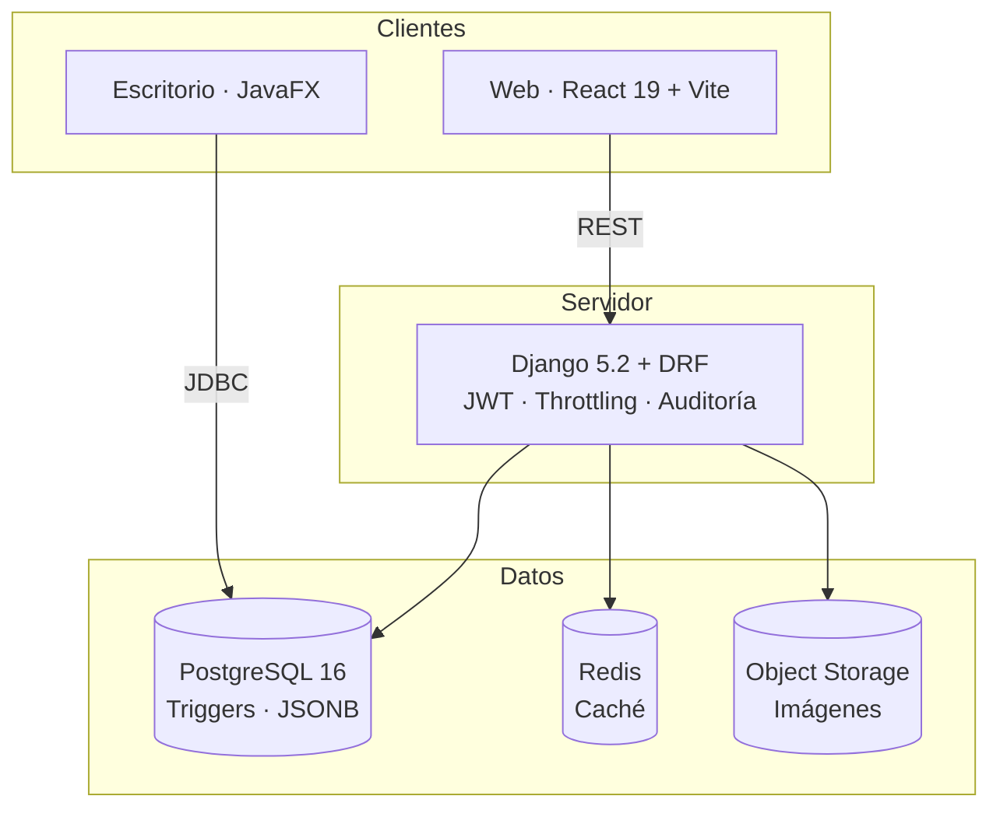

<div align="center">


### Sistema de gestión para talleres y tiendas de repuestos

Inventario, punto de venta, taller y caja en un solo lugar.<br/>
Construido para un taller de motos real en Managua, Nicaragua.

<br/>

[](./CHANGELOG.md)
[](#calidad)
[](./CHANGELOG.md)
[](https://semver.org/lang/es/)

<br/>

[](https://www.python.org/)
[](https://www.djangoproject.com/)
[](https://www.django-rest-framework.org/)
[](https://www.postgresql.org/)

[](https://react.dev/)
[](https://vite.dev/)
[](https://tailwindcss.com/)
[](https://redis.io/)

<br/>

**[Módulos](#módulos)** · **[Arquitectura](#arquitectura)** · **[Instalación](#instalación)** · **[Seguridad](#seguridad)** · **[Changelog](./CHANGELOG.md)**

</div>

---

## Qué es

Inventrix es el sistema que corre el día a día de un taller de motos: lo que entra,
lo que sale, lo que se debe y lo que se cobra.

No es un ERP genérico adaptado a la fuerza. Cada módulo salió de un problema
concreto del mostrador — el presupuesto que el cliente aprueba antes de que el
mecánico toque la moto, el repuesto que se descontó del inventario pero nunca se
facturó, la caja que al cierre no cuadra y nadie sabe por qué.

<table>
<tr>
<td width="33%" valign="top">

### Vender
Punto de venta con lector de código de barras, arqueo de caja por turno y
control de quién cobró qué.

</td>
<td width="33%" valign="top">

### Reparar
Órdenes de trabajo en tablero Kanban, presupuestos que el cliente aprueba y
repuestos que salen del inventario solo cuando hay autorización.

</td>
<td width="33%" valign="top">

### Controlar
Cuentas por cobrar y por pagar, rentabilidad por producto, desempeño de
proveedores y pronóstico de demanda.

</td>
</tr>
</table>

---

## Módulos

### Operación diaria

| | Módulo | Qué resuelve |
|:--:|---|---|
|  | **Punto de venta** | Venta rápida con lector de código de barras, múltiples métodos de pago y bloqueo si no hay caja abierta |
|  | **Sesiones de caja** | Apertura y cierre por turno con arqueo. El efectivo esperado se calcula desde ventas, gastos, pagos y reembolsos |
|  | **Órdenes de trabajo** | Tablero Kanban por estado: recibida → diagnóstico → presupuesto → reparación → entrega |
|  | **Bitácora de servicio** | Registro fotográfico en los 4 módulos del servicio, con las imágenes en almacenamiento externo |
|  | **Órdenes de venta** | Ventas a crédito con abonos parciales, saldo pendiente y devoluciones |
|  | **Órdenes de compra** | Compra, recepción que suma stock de forma idempotente, y devoluciones al proveedor |

### Inventario

| | Módulo | Qué resuelve |
|:--:|---|---|
|  | **Catálogo** | SKU, código de barras, stock mínimo, precios por proveedor e importación masiva desde Excel/CSV |
|  | **Ubicaciones físicas** | Dónde está cada repuesto en la bodega: pasillo, estante, nivel |
|  | **Conteo físico** | Hoja de conteo por ubicación y aplicación de ajustes en lote, con su rastro de movimientos |
|  | **Trazabilidad** | Todo movimiento de stock queda registrado con su origen: venta, compra, taller o ajuste |
|  | **Etiquetas** | Generación de etiquetas con código de barras para imprimir |

### Dinero

| | Módulo | Qué resuelve |
|:--:|---|---|
|  | **Cuentas por cobrar** | Saldos de clientes con antigüedad (0-30, 31-60, 61-90, +90 días) |
|  | **Cuentas por pagar** | Lo que se le debe a cada proveedor, con saldo a favor si se devolvió mercadería ya pagada |
|  | **Gastos** | Libro de gastos por categoría que alimenta el estado de resultados y el arqueo de caja |
|  | **Cotizaciones** | Proformas con PDF, y presupuestos de reparación que al aprobarse cargan los repuestos a la orden |
|  | **Garantías** | Cobertura por producto vendido y gestión de reclamaciones |

### Análisis

| | Módulo | Qué resuelve |
|:--:|---|---|
|  | **Rentabilidad** | Margen real por producto y por servicio, no solo volumen de venta |
|  | **Pronóstico de demanda** | Punto de reorden calculado con la velocidad de venta real y el plazo de entrega de cada proveedor |
|  | **Desempeño de proveedores** | Quién entrega a tiempo, quién manda mercadería mala y quién tiene mejor precio |
|  | **Mantenimiento preventivo** | Qué motos tocan servicio, por kilometraje o por fecha |
|  | **Reportes** | 16 reportes con exportación a PDF y Excel |

### Administración

| | Módulo | Qué resuelve |
|:--:|---|---|
|  | **Usuarios y roles** | Dueño y operador. Los costos, márgenes y reportes financieros son solo del dueño |
|  | **Logs de auditoría** | Todo cambio de producto queda registrado por un trigger de base de datos, con usuario e IP |
|  | **Respaldos** | Respaldo restaurable con `pg_dump`, verificado antes de darse por bueno |
|  | **Proveedores de IA** | Configuración de OpenAI, Anthropic, Gemini o DeepSeek con la clave cifrada en reposo |

> [!NOTE]
> La IA **interpreta, nunca calcula dinero**. El pronóstico de demanda se computa
> de forma determinista; la IA solo agrega contexto de estacionalidad y sugerencias
> de agrupación. Si el proveedor de IA falla, los números siguen saliendo.

---

## Arquitectura



<table>
<tr>
<td width="50%" valign="top">

### Backend

[](#)
[](#)
[](#)
[](#)

- API REST con autenticación JWT en **todos** los endpoints salvo dos
- Esquema híbrido: ORM de Django conviviendo con SQL crudo donde hace falta
- Cifrado Fernet para datos de contacto, con clave separada de la de respaldos
- Auditoría por trigger de PostgreSQL, no por señales de Django
- Transacciones atómicas con bloqueo de fila en todo lo que toca stock o dinero

</td>
<td width="50%" valign="top">

### Frontend

[](#)
[](#)
[](#)
[](#)

- 29 pantallas con carga diferida y división de código
- Caché de servidor con TanStack Query, estado de cliente con Zustand
- Modo oscuro completo y diseño adaptable a móvil
- Exportación a PDF (jsPDF) y Excel (ExcelJS) desde el navegador
- Lectura de código de barras por cámara o lector físico

</td>
</tr>
</table>

### Aplicación de escritorio

[](#)
[](#)
[](#)

Cliente nativo de Windows para el mostrador. Se conecta por JDBC **a la misma base
de datos** que la web, así que los datos son los mismos y en tiempo real.
Reimplementa la verificación de contraseñas de Django y el cifrado de contactos
para ser compatible bit a bit con el backend.

Cubre inventario, punto de venta, clientes, proveedores y compras. Taller, caja,
gastos, cotizaciones y reportes siguen siendo exclusivos de la web. Vive en su
propio repositorio, con changelog independiente.

> [!WARNING]
> En alpha. Funciona y está probada, pero no tiene rodaje en uso real. Como
> escribe sobre la misma base de datos que la web, conviene probarla contra una
> copia y mantener la web como sistema principal.

El servidor le sirve las actualizaciones: la app consulta si hay versión nueva,
verifica el checksum SHA-256 del instalador y **se niega a instalar si no puede
comprobarlo**.

---

## Instalación

### Requisitos

[](#)
[](#)
[](#)
[](#)

### Puesta en marcha

```bash
git clone https://github.com/Iampro1712/BD-Sist-Inv.git
cd BD-Sist-Inv

# Variables de entorno (ver plantillas para la lista completa)
cp backend/.env.example backend/.env
cp frontend/.env.example frontend/.env

docker compose up -d
docker compose exec backend python manage.py migrate
docker compose exec backend python manage.py createsuperuser
```

| Servicio | URL |
|---|---|
| Frontend | `http://localhost:5173` |
| API | `http://localhost:8000/api` |
| Admin de Django | `http://localhost:8000/admin` |

<details>
<summary><b>Instalación manual, sin Docker</b></summary>

<br/>

**Backend**

```bash
cd backend
python -m venv venv
source venv/bin/activate          # Windows: venv\Scripts\activate
pip install -r requirements.txt

cp .env.example .env              # completar antes de continuar
python manage.py migrate
python manage.py createsuperuser
python manage.py runserver
```

**Frontend**

```bash
cd frontend
pnpm install
cp .env.example .env
pnpm dev
```

</details>

<details>
<summary><b>Base de datos de pruebas</b></summary>

<br/>

El esquema es **híbrido**: parte lo creó Django y parte preexistía. Las migraciones
`0001`–`0004` describen un esquema antiguo que ya no existe, así que se marcan como
aplicadas sin ejecutarse.

```bash
# Postgres desechable
docker run -d --name inventrix-test -e POSTGRES_PASSWORD=postgres \
  -p 55439:5432 postgres:16

# Cargar el esquema base y aplicar migraciones reales
psql -h localhost -p 55439 -U postgres -c "CREATE DATABASE test_inventrix_ci;"
psql -h localhost -p 55439 -U postgres -d test_inventrix_ci \
  -f backend/SQL_FILES/000_base_schema_snapshot.sql

cd backend
DB_NAME=test_inventrix_ci python manage.py migrate inventory 0004 --fake
DB_NAME=test_inventrix_ci python manage.py migrate
python manage.py test --keepdb
```

</details>

<details>
<summary><b>Datos de demostración</b></summary>

<br/>

```bash
# Historial de ventas con estacionalidad real de Nicaragua
python manage.py seed_demanda_demo

# Compras con plazos de entrega variables para el análisis de proveedores
python manage.py seed_proveedores_demo

# Ambos aceptan --limpiar para revertir, y se niegan a correr
# contra producción sin --forzar.
```

</details>

---

## Seguridad

El sistema pasó por una auditoría de 10 hallazgos (v1.11.x) y una revisión de los
endpoints públicos (v1.12.x). Lo que hay hoy:

| Área | Implementación |
|---|---|
| **Autenticación** | JWT con rotación y lista de revocación. Todos los endpoints la exigen salvo los dos de actualización de la app de escritorio |
| **Autorización** | Roles dueño/operador. Los campos financieros se anulan por serializer para el operador, no se ocultan solo en la interfaz |
| **Fuerza bruta** | Límite de 5 intentos/min en login, con la identidad del cliente tomada de la entrada que agrega el proxy, no de la que manda el cliente |
| **Cifrado en reposo** | Fernet para datos de contacto y claves de IA, con claves separadas por propósito |
| **Integridad del dinero** | Transacciones atómicas con `SELECT FOR UPDATE` en stock, pagos y caja |
| **Auditoría** | Trigger de PostgreSQL que registra usuario, IP y snapshot JSONB de cada cambio |
| **Respaldos** | `pg_dump` verificado con `pg_restore --list` antes de darse por válido; excluye tablas de sesión y token |
| **Producción** | HSTS, cookies seguras, sin `DEBUG`, `SECRET_KEY` validada al arrancar y Redis obligatorio |

> [!IMPORTANT]
> Ninguna credencial, dominio ni clave vive en el repositorio. Todo se configura
> por variables de entorno; las plantillas `.env.example` documentan qué hace
> falta sin exponer valores.

---

## Calidad

[](#)
[](./.github/workflows/backend-ci.yml)

Los tests corren contra **PostgreSQL real**, no SQLite: buena parte del sistema usa
SQL crudo, triggers y restricciones de la base, y nada de eso se comporta igual en
otro motor.

Cada migración se valida en un Postgres desechable antes de tocar producción:
cargar el esquema base, aplicar, revertir, reaplicar. La regla de la casa es que
**producción se toca con respaldo previo y confirmación explícita**, nunca en
automático.

---

## Documentación

| Documento | Contenido |
|---|---|
| [CHANGELOG](./CHANGELOG.md) | Historial de versiones en formato Keep a Changelog |
| [Auditoría del sistema](./AUDITORIA_SISTEMA.md) | Análisis de seguridad y correcciones |
| [Correcciones de seguridad](./FIXES_SEGURIDAD.md) | Detalle de los hallazgos resueltos |
| [Respaldos](./RESPALDOS.md) | Cómo generar y restaurar un respaldo |
| [Bitácora de servicios](./BITACORA_README.md) | Los 4 módulos del registro fotográfico |

---

## Estado del proyecto

**Implementado y en uso:** inventario con ubicaciones, punto de venta con lector,
caja por turnos, taller en Kanban con presupuestos, cuentas por cobrar y pagar,
devoluciones en ambos sentidos, garantías, rentabilidad, pronóstico de demanda,
análisis de proveedores, respaldos restaurables y auditoría por trigger.

**Deliberadamente fuera de alcance, por ahora:**

| No tiene | Por qué |
|---|---|
| Facturación fiscal / DGI | Un taller bajo régimen de cuota fija no la necesita hoy. Sería lo primero al pasar a régimen general |
| Multi-sucursal | Un solo local. Agregarlo antes de necesitarlo complica cada consulta del sistema |
| Modo sin conexión | Requiere resolución de conflictos, que es un problema mayor que el que resuelve |
| App móvil nativa | La web adaptable cubre el caso; una app nativa duplicaría el mantenimiento |

---

<div align="center">

<sub>

**Inventrix** · Construido para JC Motoshop, Managua

[Reportar un problema](https://github.com/Iampro1712/BD-Sist-Inv/issues) ·
[Changelog](./CHANGELOG.md)

</sub>

<sub>Última actualización: septiembre de 2026 · v1.14.0</sub>

</div>
